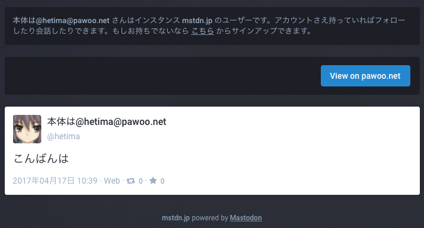

# View on my Mastodon

Mastodon に「自分のインスタンスに移動して見る」ボタンを追加する Userscript です。

## How to use

Chrome と Safari は [Tampermonkey](http://tampermonkey.net/) を使用してください。Firefox (Greasemonkey) では動作確認していません。  
https://github.com/hetima/view-on-my-mastodon/raw/master/view-on-my-mastodon.user.js を開くとこのスクリプトをインストールできます。

まず **ログインしているインスタンスの設定ページ (/settings/preferences) に移動し、右上に現れる「Use XX as default instance」をチェックしてください。**  
すると Mastodon のページに「View on XX」ボタンが表示されるようになります。クリックすると自分のインスタンスのダッシュボードに移動してユーザーやトゥートを表示します。  
実行時に XMLHttpRequest の許可を求めて来たら Always allow domain してください。

## License
WTFPL 2.0

## Author
hetima  
https://pawoo.net/@hetima  
https://twitter.com/hetima  
